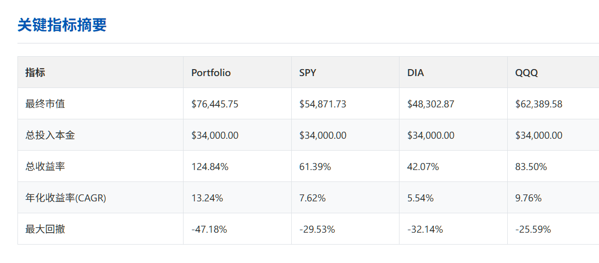
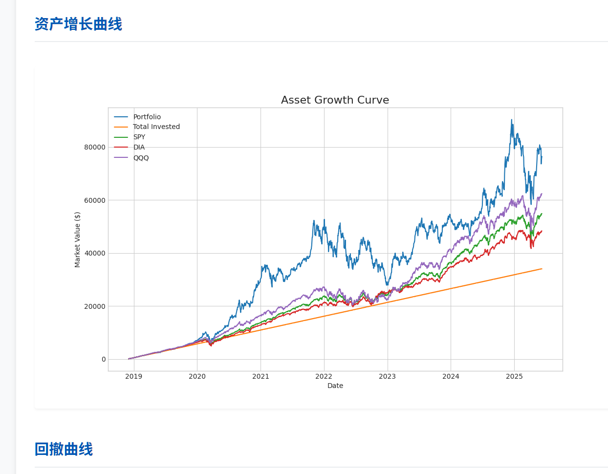

# ETF 定投策略回测工具 / etf-tracker

[English Version](#-english-version)

---

这是一个基于 Python 的命令行工具，用于回测自定义投资组合的每周定投策略（DCA - Dollar-Cost Averaging）。该工具能够处理股息再投资、交易成本，并将您的策略与标准市场基准（如 S&P 500, Dow Jones, NASDAQ 100）进行比较，最终生成一份详尽的可视化报告。

 
*(示例报告截图)*




## ✨ 功能特性

- **📈 自定义投资组合**: 支持多个股票/ETF，并可自定义权重。
- **📅 灵活的定投策略**: 可配置每周定投的星期和金额。
- **💵 股息再投资**: 自动将收到的股息按当日收盘价买入更多股份。
- **Fas 交易成本模拟**: 支持按固定金额或按百分比计算交易费用。
- **📊 全面的基准比较**: 自动与 SPY, DIA, QQQ 进行同等条件的定投回测。
- **📄 多样化的结果输出**:
    - 在命令行直接输出关键性能指标表格。
    - 生成包含多张图表和数据的独立 **HTML 报告**。
    - 保存每日市值数据为 **CSV 文件**，便于二次分析。
    - 保存所有可视化图表为 **PNG 图片**。

## 🚀 安装与设置

1.  **克隆仓库**
    ```bash
    git clone https://github.com/ShawnMa123/etf-tracker.git
    cd etf-tracker
    ```

2.  **安装依赖**
    强烈建议在虚拟环境中操作，以避免与系统包冲突。
    ```bash
    # 创建并激活虚拟环境 (Linux/macOS)
    python3 -m venv venv
    source venv/bin/activate

    # 在 Windows 上使用:
    # venv\Scripts\activate

    # 安装所有必要的库
    pip install -r requirements.txt
    ```

## ⚙️ 如何使用

使用本工具非常简单，您**只需修改 `config.py` 文件**即可。

1.  **配置策略**: 打开 `config.py` 文件，根据您的需求修改参数：
    - `PORTFOLIO`: 您想要回测的股票/ETF及其权重 (e.g., `{'VOO': 0.7, 'QQQ': 0.3}`).
    - `START_DATE` / `END_DATE`: 回测的时间范围。
    - `INVESTMENT_AMOUNT`: 每周定投的金额。
    - `INVESTMENT_DAY`: 选择周一到周五 (`'Monday'` 到 `'Friday'`) 的某一天。
    - `TRANSACTION_COST`: 设置交易成本。

2.  **运行回测**: 在项目根目录下运行主程序。
    ```bash
    python3 main.py
    ```

3.  **查看结果**:
    - 程序运行后，关键指标会直接打印在您的终端上。
    - 一个名为 `results/` 的新目录会被创建，里面包含了本次回测的详细报告，例如 `results/report_QQQ_TSLA_2024-05-22_10-30-00/`。打开其中的 `summary_report.html` 文件即可在浏览器中查看完整报告。


---
---

# 🇬🇧 English Version

This is a Python-based command-line tool for backtesting weekly Dollar-Cost Averaging (DCA) strategies on custom investment portfolios. It handles dividend reinvestment, transaction costs, and compares your strategy against standard market benchmarks (e.g., S&P 500, Dow Jones, NASDAQ 100), generating a comprehensive visual report at the end.

 
*(Sample Report Screenshot)*

## ✨ Features

- **📈 Custom Portfolios**: Supports multiple stocks/ETFs with user-defined weights.
- **📅 Flexible DCA Strategy**: Configure the investment amount and the specific day of the week for recurring investments.
- **💵 Dividend Reinvestment**: Automatically reinvests all received dividends at the closing price of the ex-dividend date.
- **Fas Transaction Cost Simulation**: Supports both fixed-amount and percentage-based commission fees.
- **📊 Comprehensive Benchmarking**: Automatically backtests your strategy against SPY, DIA, and QQQ under the same conditions.
- **📄 Versatile Outputs**:
    - Prints a summary table of key performance metrics directly to the console.
    - Generates a standalone **HTML report** with multiple charts and data tables.
    - Exports daily portfolio values to a **CSV file** for further analysis.
    - Saves all data visualizations as **PNG images**.

## 🚀 Installation & Setup

1.  **Clone the Repository**
    ```bash
    git clone https://github.com/ShawnMa123/etf-tracker.git
    cd etf-tracker
    ```

2.  **Install Dependencies**
    It is highly recommended to use a virtual environment to avoid conflicts with system packages.
    ```bash
    # Create and activate a virtual environment (Linux/macOS)
    python3 -m venv venv
    source venv/bin/activate

    # On Windows, use:
    # venv\Scripts\activate

    # Install all required libraries
    pip install -r requirements.txt
    ```

## ⚙️ How to Use

Using this tool is straightforward. **You only need to edit the `config.py` file.**

1.  **Configure Your Strategy**: Open `config.py` and modify the parameters to match your desired backtest:
    - `PORTFOLIO`: The stocks/ETFs and their respective weights (e.g., `{'VOO': 0.7, 'QQQ': 0.3}`).
    - `START_DATE` / `END_DATE`: The time frame for the backtest.
    - `INVESTMENT_AMOUNT`: The amount to invest each week.
    - `INVESTMENT_DAY`: The day of the week for your investment (from `'Monday'` to `'Friday'`).
    - `TRANSACTION_COST`: Configure transaction fees.

2.  **Run the Backtest**: Execute the main script from the project's root directory.
    ```bash
    python3 main.py
    ```

3.  **Check the Results**:
    - After the script finishes, key metrics will be printed to your terminal.
    - A new directory will be created under `results/`, containing the detailed report for this run (e.g., `results/report_QQQ_TSLA_2024-05-22_10-30-00/`). Open the `summary_report.html` file in your browser to view the full report.

